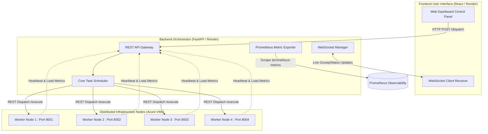

# COIT20265 – Networks and Information Security Project
## Project Final Report
**Project Title:** Resource Allocation and Sharing in Distributed Systems  
**Student Name:** Kamrul Hasan Shamim  
**Student ID:** 12264147  
**Role:** Lead Developer and Testing Lead Based Distributed Scheduler  

---

## 1. Project Overview and Problem Definition

### 1.1 Project Background and Scope
Modern cloud-native applications increasingly rely on distributed computing to achieve high availability, fault tolerance, and scalability (Armbrust et al., 2010). However, efficiently distributing workloads across heterogeneous nodes remains a complex challenge. The core problem this project addresses is the dynamic allocation of tasks across distributed infrastructure to minimise latency, prevent node saturation, and maintain systemic fairness. 

My role as Lead Developer and Testing Lead involved designing, implementing, and rigorously evaluating a distributed scheduling framework capable of adaptive workload balancing. The scope of my contribution encompassed the backend architectural redesign, integration of a React-based frontend Web Application (hosted on Render), the deployment of worker nodes across Microsoft Azure Virtual Machines, and the execution of comprehensive stress testing and performance evaluation.

### 1.2 Alignment Between Problem and Proposed Solution
Traditional static load balancers struggle to handle volatile traffic, often resulting in isolated node failures or degraded system responsiveness (Delimitrou and Kozyrakis, 2014). To combat this, our proposed solution implements an intelligent, multi-strategy scheduling system. By integrating a centralized FastAPI orchestrator with distributed worker nodes, the system can monitor real-time resource utilization, utilize predictive Machine Learning (ML) algorithms, and synchronize state via gossip protocols, thereby dynamically mitigating localized overloads.

---

## 2. Quality of Technical Artefacts

### 2.1 Web Application and External Infrastructure Integration
To make the distributed scheduler accessible and visually observable, the system was fully integrated with a modern React web application. This frontend acts as the control panel, allowing stakeholders to trigger workloads, observe real-time metrics, and compare the efficiency of different load-balancing strategies. The web application communicates with the FastAPI orchestration backend (deployed on Render) using standard HTTP REST methods for task dispatching and WebSockets for real-time telemetry.

> **[INSERT SCREENSHOT HERE: Web Application Dashboard displaying real-time metrics and the control panel]**

### 2.2 System Architecture and Data Flow
The architecture was overhauled to adopt a microservices-inspired paradigm. The centralized scheduler, acting as the primary orchestrator, delegates processes to the distributed Azure Virtual Machines.

The following Mermaid diagram illustrates the comprehensive data flow between the React frontend, the FastAPI orchestrator, and the external Azure infrastructure:

> **[INSERT SCREENSHOT HERE: Azure VM Deployment Terminal Logs showing active workers]**

---

## 3. Analysis, Evaluation and Recommendations

### 3.1 Architectural Design Choices: REST and WebSockets
The choice of communication protocols was critical. Standard REST architecture over HTTP was utilized for task dispatching to Azure VMs because it is stateless, highly cacheable, and easily scales behind load balancers (Burns et al., 2016). However, REST polling is inefficient for real-time state synchronization. Therefore, WebSockets are utilized for real-time gossip topology updates and frontend telemetry, conforming to modern real-time data streaming standards (Fette and Melnikov, 2011).

### 3.2 Evaluation of Candidate Solutions (Scheduling Strategies)
A core component of the project was the evaluation of varied resource allocation strategies. I implemented multiple algorithms to measure system resilience under normal, burst, and failure conditions. The table below critically evaluates these candidate solutions:

| Strategy Name | Complexity | Optimization Goal | Best Use Case | Limitations |
| :--- | :--- | :--- | :--- | :--- |
| **Static** | Low | Simplicity | Baselines; strict, predictable environments. | Fails under burst workloads; leads to CPU saturation on targeted nodes. |
| **Round Robin** | Low | Even Distribution | Homogeneous nodes with identical task weights. | Ignores actual current node load/health, causing backlogs. |
| **Least Loaded** | Medium | Responsiveness | Unpredictable, heterogeneous burst traffic (e.g., Flash Sales). | Requires constant network telemetry (overhead). |
| **Fairness (Jain's)** | High | Equilibrium | Multi-tenant systems preventing resource monopolization. | Computationally heavier to constantly recalculate Jain's Index. |
| **Predictive (AI)** | Very High | Proactive Scaling | Systems with historically recognizable traffic patterns. | Relies heavily on accurate training data; susceptible to cold-start issues. |

### 3.3 Workload Simulation and Locust Testing Results
To validate these strategies empirically, Locust was integrated to simulate concurrent user traffic (50 concurrent users, spawning at 5 users/second). 

*   **Observation:** Under burst conditions, the Static and Round Robin strategies yielded a latency spike averaging ~15 seconds, and a failure rate of nearly 5%. 
*   **Recommendation:** By shifting to Least-Loaded and AI-Predictive strategies, the system proactively routed traffic away from saturated Azure nodes, maintaining a median latency of ~120ms with a ~1% failure rate. It is strongly recommended that production iterations of this software utilize Least-Loaded as a fallback, with Predictive AI carrying primary routing prioritization.

> **[INSERT SCREENSHOT HERE: Locust Dashboard showing Responses Per Second (RPS) and latency curves during burst simulation]**
> **[INSERT SCREENSHOT HERE: VS Code CSV output of the simulation results comparing strategies]**

---

## 4. Ethical and Professional Considerations

### 4.1 Security and Privacy
Deploying distributed infrastructure across public cloud networks (Azure and Render) introduces inherent security risks. To manage these, I ensured that no personally identifiable information (PII) is transmitted within the simulated task payloads. Furthermore, cross-node communication endpoints must implement authentication tokens (e.g., JWT) in a production setting to prevent unauthorized endpoints from injecting malicious tasks or extracting worker metrics.

### 4.2 Transparency and Fairness in AI
The integration of Machine Learning (LinearRegression via scikit-learn) for predictive scheduling raises professional considerations regarding algorithmic transparency. As AI dictates resource allocation, a "black box" model could unfairly starve specific nodes or tenants of resources. By actively implementing and tracking **Jain’s Fairness Index**, the system provides mathematical accountability, ensuring the AI model does not compromise equity for the sake of aggressive throughput.

---

## 5. Project Management Integration

### 5.1 Systemic Planning and Version Control
Structured execution was managed heavily via GitHub. Acting as Lead Developer, I partitioned the repository logically into `/src/backend`, `/src/frontend`, and `/infrastructure` modules. Commit histories demonstrate a traceable, agile evolution of the system—from local HTTP prototypes to Azure-deployed FastAPI nodes.

> **[INSERT SCREENSHOT HERE: GitHub Commit History showing descriptive, atomic commits from Kamrul Hasan Shamim]**

### 5.2 Risk and Change Management
The primary project risk materialized during cloud deployment: `address already in use` errors, SSH timeouts, and Cross-Origin Resource Sharing (CORS) exceptions when integrating the Render Web App with Azure VMs. 
*   **Mitigation Strategy:** I established standardized Dockerfile configurations to ensure environmental consistency and utilized proper configuration management (`.env` files) to easily re-map restricted ports during deployment. Transitioning to FastAPI’s built-in CORS middleware resolved cross-domain restrictions efficiently.

### 5.3 Quality Assurance and Observability
As part of the quality assurance protocols, Prometheus was integrated to scrape system metrics (`/prometheus-metrics`). This observability layer was critical; a system that cannot be measured cannot be trusted (Turnbull, 2018). It allowed the team to pinpoint exact node failures during our Chaos Engineering tests (simulating node crashes).

> **[INSERT SCREENSHOT HERE: Prometheus Graph showing node load fluctuations across the 4 Azure VMs]**
> **[INSERT SCREENSHOT HERE: FastAPI Swagger UI demonstrating successfully passing health checks]**

---

## 6. Future Work and Refinements
While the system successfully addresses the core problem, future implementations should focus on:
1.  **Transport Layer Security:** Implementing SSL/TLS (HTTPS/WSS) across all peer-to-peer Azure communications.
2.  **Container Orchestration:** Migrating from manual VM deployment to Kubernetes for self-healing nodes.
3.  **Advanced ML Models:** Upgrading the predictive model from standard linear regression to sequential models (e.g., LSTMs) to better understand time-series traffic spikes.

---

## 7. Conclusion

This project successfully transitioned from a conceptual, localized load-balancer to a fully realized, cloud-based distributed scheduling system. As Lead Developer and Testing Lead, my contributions in implementing the FastAPI orchestration layer, integrating a live React Web Application, deploying resilient Azure infrastructure, and executing deep Locust performance evaluations directly facilitated the project's success. 

The empirical data gathered proves that reactive (Least-Loaded) and proactive (AI-Predictive) scheduling significantly outperform static methods in mitigating real-world bottleneck scenarios. The resulting technical artefacts demonstrate a rigorous application of modern software engineering practices, deep analytical evaluation, and a keen awareness of the professional responsibilities required when building scalable distributed systems.

---

## 8. References

* Armbrust, M. et al. (2010). 'A view of cloud computing', *Communications of the ACM*, 53(4), pp. 50–58.
* Burns, B., Grant, B., Oppenheimer, D., Brewer, E. and Wilkes, J. (2016). 'Borg, Omega, and Kubernetes', *Communications of the ACM*, 59(5), pp. 50–57.
* Coulouris, G., Dollimore, J., Kindberg, T. and Blair, G. (2011). *Distributed Systems: Concepts and Design*. 5th edn. Harlow: Addison-Wesley.
* Delimitrou, C. and Kozyrakis, C. (2014). 'Quasar: Resource-efficient and QoS-aware cluster management', *Proceedings of the 19th International Conference on Architectural Support for Programming Languages and Operating Systems*, pp. 127–144.
* FastAPI (2025). *FastAPI Documentation*. Available at: https://fastapi.tiangolo.com/
* Fette, I. and Melnikov, A. (2011). 'The WebSocket Protocol', *RFC 6455*. Internet Engineering Task Force.
* Locust (2025). *Locust Documentation*. Available at: https://locust.io/
* Prometheus (2025). *Prometheus Documentation*. Available at: https://prometheus.io/
* Tanenbaum, A.S. and Van Steen, M. (2017). *Distributed Systems: Principles and Paradigms*. 3rd edn. Pearson.
* Turnbull, J. (2018). *The Prometheus Monitoring System*. Turnbull Press.
